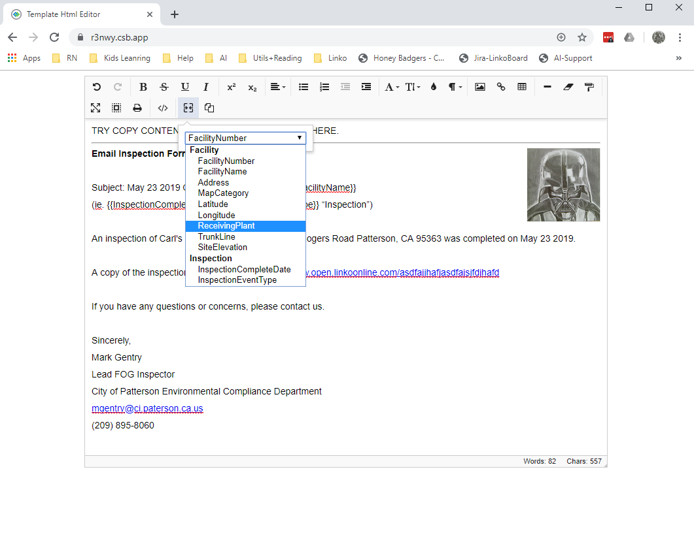

# Spec list

## General content composing:
- Copy content from WORD or GOOGLE DOC directly into the editor

  - Choose **Keep** paste in HTML for composing a **Letter Template** 
  - Choose **Insert only Text** for composing an **Email Template** 

- Able to style from the toolbar:

  - Text-style: bold, strike-though, underscore, italic 
  - Subscript: upper, lower
  - Align: left, right, top, bottom
  - Insert bullet list, number list
  - Increase or decrease indent
  - Set font family, font color, fill font background color
  - Insert formatted block: normal, h1, h2, h3, h4, quoted
  - Insert image (embedded base64 images)
    - Images are resizable

  - Insert link
  - Insert table 
    - Resizable
    - Can insert row above or bottom
    - Can insert column left or right
    - Can split a cell vertical or horizontal
    - Can align particular cell
    - Can set cell background color

  - Support drag-drop text and images
  - Advanced: can directly modify HTML/CSS/JS code

## Linko Template Specific

  - Can insert MERGE FIELD which dynamic interpolate to a facility or inspection’s instance field value
   

# Instruction of composing template
* Try to make a template at WORD and paste into this editor as start
* Play around with the toolbar function, make the template looked well
* Replace actual data to MERGE FIELD by toolbar “Insert Merge Field”
* Use “Print” to preview the result in a A4 letter
* Once it down, click toolbar “Copy Content to Clipboard” to copy data and use it as the composed template

# Cons should know about this editor
* The WORD background image or color cannot COPY out and PASTE into this editor
* The header and footer are not supported at the moment, you have to manual add each page’s header and footer and preview via “Print” feature
